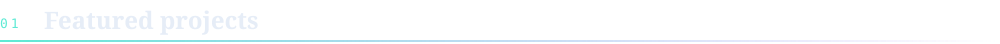
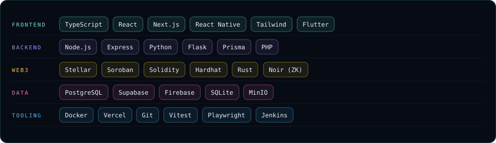

🇬🇧 English · <a href="README.md">🇪🇸 Español</a>

  

 

**Systems Engineering** student at **UCB San Pablo (La Paz, Bolivia)**. I build web and mobile applications
and blockchain-based systems, with a special interest in security, applied cryptography and software quality.

- **Blockchain:** wallets on Stellar/Soroban, smart contracts in Solidity and Rust, zero-knowledge circuits in Noir.
- **Capstone project:** verifiable e-voting system with W3C credentials, zero-knowledge proofs and distributed key custody.
- **Information systems:** internal tools, document digitization with OCR/HTR and business management software.
- **Quality:** unit, integration and E2E tests with Vitest, Hardhat and Playwright, plus regression matrices.

 

<table>
<tr>
<td width="50%"></td>
<td width="50%"></td>
</tr>
<tr>
<td width="50%"></td>
<td width="50%"></td>
</tr>
<tr>
<td colspan="2" align="center"></td>
</tr>
</table>

<b>Technical details</b>

 

| Project | Technical aspects |
|---|---|
| **GYRO** | Service that streams the Stellar network and detects deposits, with transaction deduplication. The hackathon version adds on-chain user registration in Soroban and a simulated KYC flow. |
| **VotoSeguro** | Monorepo (Next.js 15, Express, Prisma, Hardhat). ElGamal-encrypted vote over secp256k1, non-interactive Schnorr proof and Shamir 3-of-5 for the election key. 122 backend tests, 12 contract tests, 27 frontend tests, 9 E2E and a 90-case regression matrix. |
| **Sacra360** | Document upload, background OCR/HTR processing with progress tracking, human review and duplicate validation across records. |
| **GestorElectric** | Independent modules for accounting, purchasing, inventory, networks, support and reporting. |

 

  

 

| | |
|---|---|
| [**TaskLegends**](https://github.com/DiegoMoron0102/TaskLegends) | Flutter mobile app for gamified task management |
| [**front_vet**](https://github.com/DiegoMoron0102/front_vet) | React + Tailwind frontend with a Jenkins pipeline and Firebase hosting |
| [**BASE-HACK**](https://github.com/DiegoMoron0102/BASE-HACK) · [**GYRO-HACKATHON**](https://github.com/DiegoMoron0102/GYRO-HACKATHON) | GYRO iterations built for blockchain hackathons |
| **Metrics dashboards** | Video-retention analytics (Meta) and quarterly reports, deployed on Vercel |
| [**Proyecto-Angular**](https://github.com/DiegoMoron0102/Proyecto-Angular) · [**PROYECTO_FINAL**](https://github.com/DiegoMoron0102/PROYECTO_FINAL) | Academic projects in Angular and PHP (2023) |
