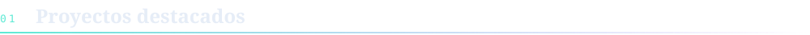
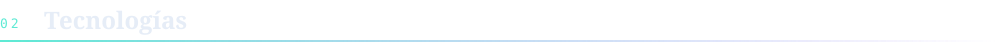
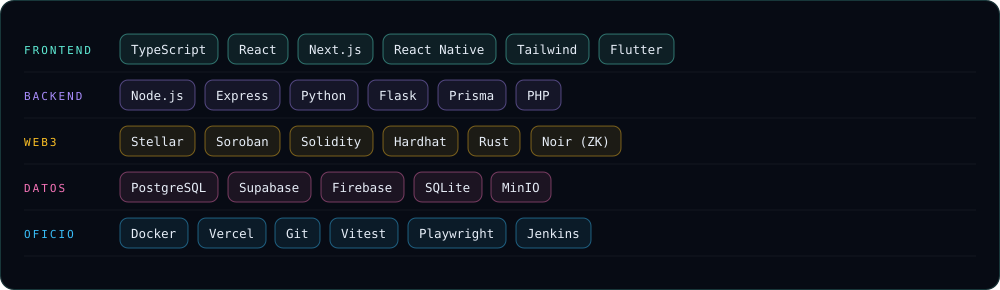
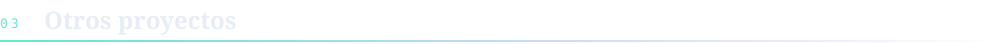

<a href="README.en.md">🇬🇧 English</a> · 🇪🇸 Español

  

 

Estudiante de **Ingeniería de Sistemas en la UCB San Pablo (La Paz, Bolivia)**. Desarrollo aplicaciones web y móviles
y sistemas basados en blockchain, con especial interés en seguridad, criptografía aplicada y calidad del software.

- **Blockchain:** wallets sobre Stellar/Soroban, contratos inteligentes en Solidity y Rust, circuitos de conocimiento cero en Noir.
- **Proyecto de grado:** sistema de votación electrónica verificable con credenciales W3C, pruebas de conocimiento cero y custodia distribuida de claves.
- **Sistemas de información:** herramientas internas, digitalización de documentos con OCR/HTR y software de gestión para negocios.
- **Calidad:** pruebas unitarias, de integración y E2E con Vitest, Hardhat y Playwright, y matrices de regresión.

 

<table>
<tr>
<td width="50%"></td>
<td width="50%"></td>
</tr>
<tr>
<td width="50%"></td>
<td width="50%"></td>
</tr>
<tr>
<td colspan="2" align="center"></td>
</tr>
</table>

<b>Detalles técnicos</b>

 

| Proyecto | Aspectos técnicos |
|---|---|
| **GYRO** | Servicio que monitorea la red Stellar en streaming y detecta depósitos, con sistema de deduplicación de transacciones. La versión para hackathon incluye registro de usuarios on-chain en Soroban y un flujo KYC simulado. |
| **VotoSeguro** | Monorepo (Next.js 15, Express, Prisma, Hardhat). Voto cifrado con ElGamal sobre secp256k1, prueba Schnorr no interactiva y Shamir 3-de-5 para la clave de la elección. 122 pruebas de backend, 12 de contratos, 27 de frontend, 9 E2E y una matriz de regresión de 90 casos. |
| **Sacra360** | Subida de documentos, procesamiento OCR/HTR en segundo plano con seguimiento de progreso, revisión humana y validación de duplicados entre registros. |
| **GestorElectric** | Módulos independientes de contabilidad, compras, inventario, redes, soporte e informes. |

 

  

 

| | |
|---|---|
| [**TaskLegends**](https://github.com/DiegoMoron0102/TaskLegends) | Aplicación móvil en Flutter para gestión gamificada de tareas |
| [**front_vet**](https://github.com/DiegoMoron0102/front_vet) | Frontend en React y Tailwind con pipeline Jenkins y hosting en Firebase |
| [**BASE-HACK**](https://github.com/DiegoMoron0102/BASE-HACK) · [**GYRO-HACKATHON**](https://github.com/DiegoMoron0102/GYRO-HACKATHON) | Iteraciones de GYRO desarrolladas para hackathons de blockchain |
| **Dashboards de métricas** | Analítica de retención de video (Meta) y reportes trimestrales, desplegados en Vercel |
| [**Proyecto-Angular**](https://github.com/DiegoMoron0102/Proyecto-Angular) · [**PROYECTO_FINAL**](https://github.com/DiegoMoron0102/PROYECTO_FINAL) | Proyectos académicos en Angular y PHP (2023) |
